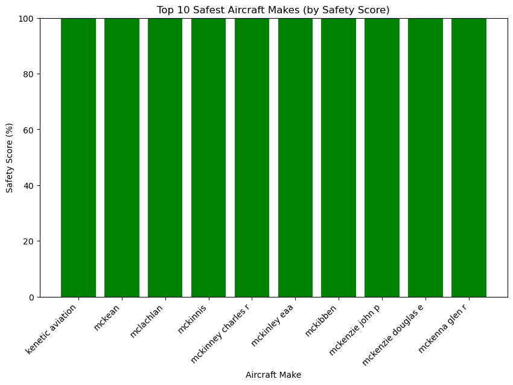

# AVIATION RISK ANALYSIS

## OVERVIEW
The aviation industry is highly sensitive to safety issues, as accidents can cause loss of life, financial damage, and reduced public trust. By analyzing historical accident data, we can identify trends and patterns that reveal which aircraft types are safer than others. This project focuses on studying accident records to evaluate aircraft risk levels and highlight models with better safety performance. The goal is to provide useful insights that can guide safer purchase and operational decisions.  

## BUSINESS UNDERSTANDING
### Problem Statement
When organizations or buyers choose aircraft, most of the focus is often placed on cost, performance, or availability. However, without looking closely at safety records, there is a risk of selecting aircraft with poor accident histories. This can lead to higher risks, unexpected costs, and safety challenges in the long run. The problem we aim to solve is how to use accident data to measure and compare safety levels across aircraft models, so that decisions are informed by both performance and risk.  

### Key Objectives  
- To explore and understand the aviation accident dataset.  
- To clean and prepare the data for analysis by addressing missing and inconsistent values.  
- To calculate accident severity metrics such as fatalities, injuries, and risk scores.  
- To rank aircraft models based on accident frequency and severity.  
- To provide clear visualizations and insights that support safer aircraft purchase and operational choices.  

## DATA
The dataset comes from the National Transportation Safety Board (NTSB) and contains records of civil aviation accidents and selected incidents from 1962 to 2023. Each record provides details such as the date of the event, aircraft information, operator, location, injury severity, and probable cause.  

The dataset is valuable because it allows us to analyze historical aviation accidents, identify trends, and assess potential risk factors across different types of aircraft. However, it also contains missing values and inconsistencies that must be handled during data cleaning before meaningful insights can be drawn.  

## RESULTS/ANALYSIS

### Accidents over time

The sharp spike seen around 1982 does not represent an actual surge in accidents but is likely due to a change in reporting or data collection methods. What is more important is the clear downward trend from the mid-1980s to the present, showing continuous improvements in aviation safety. Advances in aircraft technology, stricter regulations, and better training have all contributed to reducing accidents, even as global air traffic has increased. Overall, the long-term trend demonstrates that aviation is becoming progressively safer.

### Top 10 safest aircrafts make

The graph shows that Kenetic Aviation, McKean, McLachlan, McKinnis, McKinney, McKibben, and McKenzie have the fewest accidents over the years, making them the safest options to consider.

### Accidents by phase of flight

Landing is a critical phase of flight, and pilots must exercise extra care. The graph shows that many accidents over the years have occurred due to incorrect or unsafe landings, highlighting the importance of proper technique and attention during this phase.

## Conclusions

1.Analysis of accident data over the years indicates that certain aircraft makes, such as Cessna and Piper, consistently show higher accident rates, suggesting increased operational risk.

2.Other manufacturers, including Kenetic Aviation, McKean, McLachlan, and McKibben, demonstrate stronger safety records with minimal incidents, making them safer choices.

3.The landing phase emerges as the most critical and accident-prone stage of flight, underlining the need for heightened pilot attention and precision.

4.Accidents are influenced not only by aircraft make but also by pilot experience, operational procedures, and adherence to safety protocols.

## Next Steps

1.Enhance Pilot Training: Focus on landing techniques, emergency procedures, and decision-making under pressure.

2.Aircraft Selection Guidelines: Prefer aircraft with lower historical accident rates and ensure thorough risk assessment when considering higher-risk makes.

3.Data-Driven Safety Policies: Regularly update safety protocols based on accident trends and patterns identified in the dataset.